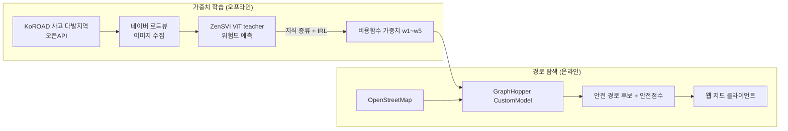

<div align="center">

# 🛴 PM 세이프라인 · PM SafeLine

**개인형 이동장치(PM) 이용자를 위한 연속주행 안전 경로 탐색 서비스**

최단거리가 아니라, 자전거도로가 최대한 끊기지 않고 위험 도로구조를 피하는 경로를 찾습니다.

<br>


<sub>2026 KT디지털인재장학생 · AI 기반 사회문제해결 프로젝트</sub>

</div>

---

## 📌 개요

전동킥보드·자전거 등 PM 이용자는 **자전거도로 단절 → 차도 합류**, 교차로 진입, 보행자 혼재 같은
위험 상황을 자주 겪습니다. 기존 지도 서비스는 최단거리·최단시간 위주라 이런 **도로 구조적 위험**을
경로에 반영하지 못합니다.

**PM 세이프라인**은 이용자 행동을 규제하는 대신, 위험을 유발하는 도로 구조를 분석해
**최대한 연속적이고 안전하게 주행할 수 있는 경로**를 추천합니다.

> **연속주행** = 출발지부터 목적지까지 자전거도로가 최대한 유지되고, 차도·보도·자전거도로 간
> 불필요한 전환이 적은 상태.

자세한 설계 근거는 [`PROJECT.md`](PROJECT.md) 참고.

---

## 🧭 아키텍처



- **학습**: 실사고(KoROAD) 지점의 로드뷰로 위험도 teacher를 학습하고, 이를 OSM feature 가중합
  비용함수(student)로 **지식 증류 + IRL(Bradley-Terry)**. 배포 시엔 OSM 데이터만으로 동작.
- **서비스**: 학습된 가중치를 GraphHopper CustomModel에 주입해 실시간 경로 탐색. FM 호출 없음.

---

## 🗂️ 프로젝트 구성 — 2개 파트

| 파트 | 위치 | 설명 |
|---|---|---|
| **① 경로 탐색 서버** | [`src/main/kotlin`](src/main/kotlin) | Kotlin/Ktor + GraphHopper 안전경로 API + 웹 테스트 클라이언트 |
| **② 학습 데이터셋** | [`src/main/python`](src/main/python) | KoROAD·로드뷰 수집 → torchvision 포맷 PyTorch Dataset |

---

## ① 경로 탐색 서버 (Kotlin / Ktor / GraphHopper)

### 핵심 설계

| 요소 | 구현 | 근거 |
|---|---|---|
| 다중 위험변수 → 스칼라 비용 | 가중합 `CustomModel` (`PmCostWeights`) | NP-hard 회피 (§2.1·2.2) |
| 도로유형 전환 상태 반영 | `turn_costs` edge-based 탐색 | 상태확장 (§2.3) |
| 복수 후보 경로 | k-alternative routing | Yen's 계열 (§2.4) |
| 경로 안전성 비교 | 자전거도로 비율·전환수·안전점수 | (§1.4) |

**비용함수** (IRL로 학습되는 가중치):
```
cost(edge) = w1·거리 + w2·차도 + w3·전환 + w4·교차로 + w5·버스겹침
```

### 빠른 시작

```bash
# 0) (선택) 대전 OSM 도로망이 있어야 실제 경로 탐색 가능. .env 에 경로 지정:
#    PM_OSM_FILE=data/osm/daejeon.osm   (없으면 엔진 비활성 → /route 는 503)

# 1) 서버 실행 (.env 를 자동 로드)
./gradlew run
#    -> http://localhost:8080
```

| Task | 설명 |
|---|---|
| `./gradlew run` | 서버 실행 |
| `./gradlew test` | 테스트 |
| `./gradlew build` | 빌드 |

> 🔑 서버는 기동 시 프로젝트 루트 `.env`를 자동으로 읽습니다(별도 export 불필요).
> JDK 21 필요.

### 웹 클라이언트 · API 문서

| 경로 | 내용 |
|---|---|
| [`/`](http://localhost:8080/) | 웹 테스트 클라이언트 (Leaflet 지도, 가중치 슬라이더, 경로 시각화) |
| [`/?demo=1`](http://localhost:8080/?demo=1) | 샘플 경로(충남대→대전시청) 자동 실행 데모 |
| [`/swagger`](http://localhost:8080/swagger) | 인터랙티브 Swagger UI |
| [`/openapi`](http://localhost:8080/openapi) | 정적 API 문서 (ReDoc) |
| [`/health`](http://localhost:8080/health) | 헬스체크 (엔진 활성 여부) |

### REST API

<details>
<summary><b>GET /health</b> — 상태 확인</summary>

```json
{ "status": "ok", "engine": true }
```
</details>

<details>
<summary><b>POST /route</b> — 안전 경로 탐색</summary>

**요청**
```json
{
  "fromLat": 36.3664, "fromLon": 127.3447,
  "toLat": 36.3504,  "toLon": 127.3845,
  "weights": {                    // 생략 시 서버 기본(IRL) 가중치
    "distanceWeight": 1.0, "arterialPenalty": 3.0,
    "transitionPenalty": 2.0, "crossingPenalty": 1.5, "busOverlapPenalty": 1.0
  },
  "alternatives": 3
}
```

**응답**
```json
{
  "routes": [{
    "distanceMeters": 6502.4,
    "durationMillis": 1488000,
    "weight": 1845.8,
    "safetyScore": 36.0,
    "geometry": [[127.3447, 36.3664], "..."],
    "metrics": { "bikeInfraRatio": 0.17, "transitionCount": 9 }
  }]
}
```
전체 스키마·예시·에러(400/422/503)는 `/swagger` 참고.
</details>

---

## ② 학습 데이터셋 (Python / `pm_safeline`)

로드뷰 기반 위험도 teacher 모델의 학습 데이터를 구축합니다. 수집 단계는 **torch 없이** 동작하며,
`Dataset` 클래스만 torch를 지연 임포트합니다.

```bash
cd src/main/python

python -m pm_safeline check                     # 설정 점검
python -m pm_safeline download                  # KoROAD 사고 다발지역 자동 다운로드
PM_SV_PROVIDER=naver python -m pm_safeline collect   # 사고+OSM+negative+로드뷰 이미지
python -m pm_safeline stats                      # 수집 통계
```

| 단계 | 모듈 | 소스 |
|---|---|---|
| 사고 지점 | `utils/koroad.py` | KoROAD 이륜차 교통사고 다발지역 오픈API (대전, 2017~2024) |
| 도로망·지점 | `utils/geo.py` | OpenStreetMap (osmnx) |
| 대조 지점 | `utils/negatives.py` | exposure-matched 샘플링 |
| 로드뷰 이미지 | `utils/streetview.py` | 네이버 로드뷰(키 불필요) / Google / mock |
| Dataset | `datasets/dataset.py` | torchvision `ImageFolder` 호환 + manifest |
| teacher | `models/teacher.py` | ZenSVI ViT 파인튜닝 (linear probe) |

자세한 사용법은 [`src/main/python/README.md`](src/main/python/README.md).

---

## 🔐 환경 변수 (`.env`)

`.env.default`를 복사해 `.env`를 만들고 값을 채웁니다. `.env`는 gitignore 되며 서버·파이썬 양쪽이
자동 로드합니다.

```bash
cp .env.default .env
```

| 변수 | 용도 |
|---|---|
| `KOROAD_API_KEY` | KoROAD 오픈API 인증키 ([발급](https://opendata.koroad.or.kr)) |
| `PM_OSM_FILE` | 대전 OSM(.osm/.pbf) 경로 — 서버 경로탐색 활성화 |
| `PM_SV_PROVIDER` / `PM_SV_API_KEY` | 스트리트뷰 provider (mock·google·naver) |
| `PM_DATA_DIR` | 데이터 루트 (기본: 프로젝트 루트 `data/`) |

---

## 🧰 기술 스택

| 영역 | 선택 |
|---|---|
| 경로 탐색 엔진 | GraphHopper 10 (Java/Kotlin) |
| 서버 | Kotlin 2.4 · Ktor 3.5 · Netty |
| 가중치 학습 | IRL (Bradley-Terry) · 지식 증류 |
| 위험도 teacher | ZenSVI (ViT) + KoROAD 데이터 |
| 데이터셋 | Python 3.14 · geopandas · osmnx · PyTorch/torchvision |
| 도로 데이터 | OpenStreetMap |
| 프론트엔드 | Leaflet · Pretendard |

---

## 📁 디렉터리

```
proj/
├── src/main/kotlin/          # ① 경로 탐색 서버
│   ├── routing/              #   GraphHopper 엔진·가중치·경로 서비스
│   ├── plugins/ · api/       #   Ktor 플러그인·DTO
│   └── Dotenv.kt · main.kt   #   .env 자동 로드 진입점
├── src/main/resources/
│   ├── static/               #   웹 클라이언트(index.html·favicon)
│   └── documentation.yaml    #   OpenAPI 스펙
├── src/main/python/          # ② 학습 데이터셋 (pm_safeline)
│   └── pm_safeline/{utils,datasets,models}
├── data/                     # 런타임 데이터 (gitignore)
├── docs/                     # 제안서·리소스·생성 API 문서
└── PROJECT.md                # 상세 설계 문서
```

---

<div align="center">
<sub>© 2026 KT디지털인재장학생 사회문제해결프로젝트 · 사고 데이터 출처: 도로교통공단 TAAS/KoROAD</sub>
</div>
